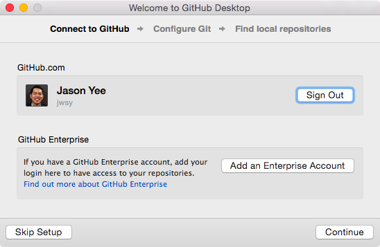
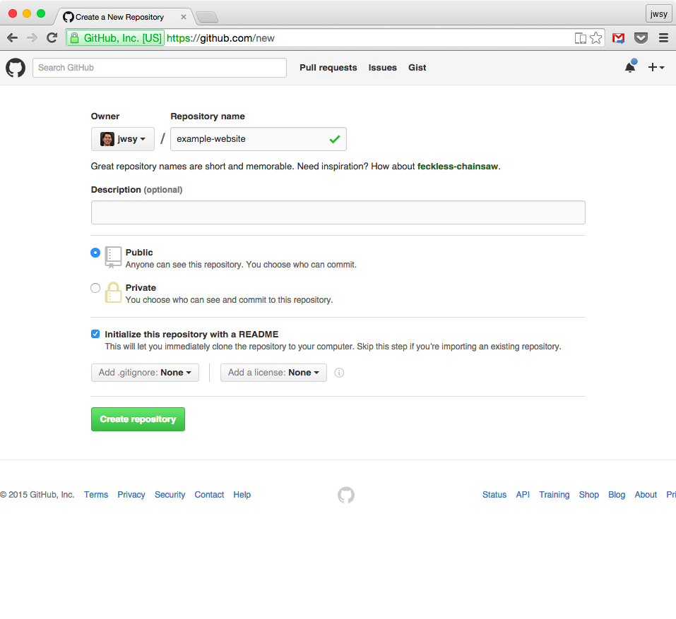
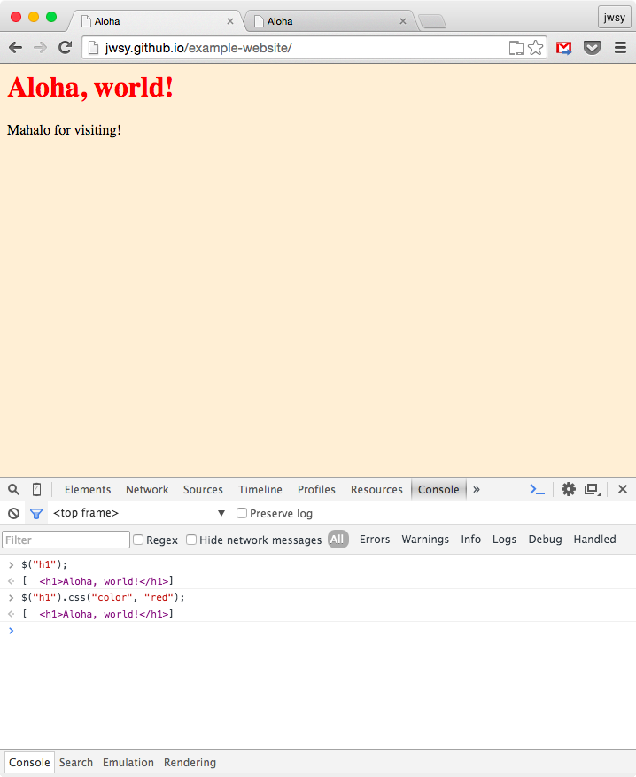

# example-website
This is a tutorial on what to do once you've finished building a website in the fantastic [Codecademy tutorials](https://www.codecademy.com/en/skills/make-a-website) and want to make your own web pages and limited apps. This tutorial specifically describes how to set up a website hosted by GitHub using the Github Desktop GUI in OSX.

Prerequisites:
* GitHub Account at [https://github.com](https://github.com)
* Install the [Atom text editor](https://atom.io)
* Install [GitHub Desktop](https://atom.io)

### Overview
We'll start by setting up a your "development environment" and then creating and contributing to a repository in GitHub. Ultimately, we'll finish with a page hosted on the internet that you can access from anywhere.

