# example-website
This is a tutorial on what to do once you've finished building a website in the fantastic <a href="https://www.codecademy.com/en/skills/make-a-website" target="_blank">Codecademy tutorials</a> and want to make your own web pages and limited apps. This tutorial specifically describes how to set up a website hosted by GitHub using the Github Desktop GUI in OSX.

### Prerequisites
* GitHub Account at <a href="https://github.com" target="_blank">https://github.com</a>
* Install the <a href="https://atom.io" target="_blank">Atom text editor</a>
* Install <a href="https://atom.io" target="_blank">GitHub Desktop</a>

### Overview
We'll start by setting up a your "development environment" and then creating and contributing to a repository in GitHub. Ultimately, we'll finish with a page hosted on the internet that you can access from anywhere.


## Initial Setup

1. Install the <a href="https://atom.io" target="_blank">Atom text editor</a>

1. Get an account at <a href="https://github.com" target="_blank">https://github.com</a>. Once you've created your account, create a new repository by clicking the '+' sign next to your profile pic in the upper right.

  

1.  Create a repository, in this example I create one named _example-website_. Make it _Public_ and use the defaults.

  

1. Once the repository is created, install and configure GitHub Desktop. Configuration requires you to sign in with your Github account credentials that you created earlier.

  

1. In GitHub Desktop, click the '+' in the upper left and clone the repo you just created.

  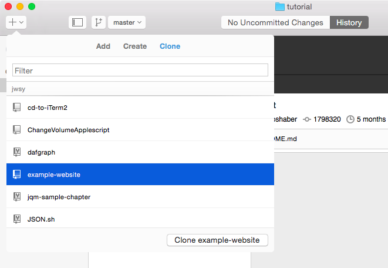

Congratulations, you're ready to start building your webpage! :smile:

### Create your local webpage

1. Once you've cloned the repo to your computer, let's build a local webpage stored on your computer. Click the branch button and create a new branch named _gh-pages_ -- this name is important and more detail about this can be found in the [GitHub Pages documentation](https://pages.github.com/).

  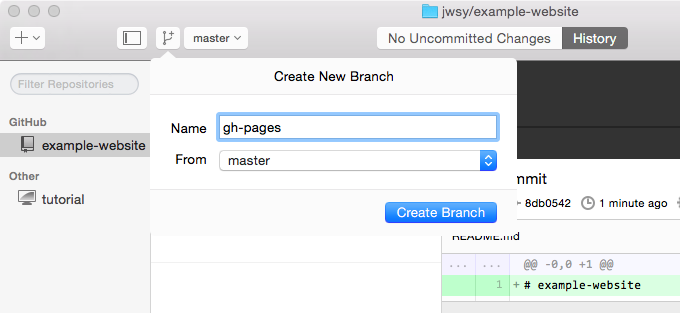

1. In GitHub Desktop, edit your repo in your text editor Atom by right-clicking the repo and selecting Open in Atom. Be sure that the repo you're working on is gh-pages as shown in the upper-right of the below image.

  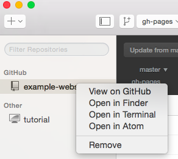

  You should see Atom like this, and note the location in the window title. The location should look like _/Users/<username>/GitHub/example-website_

  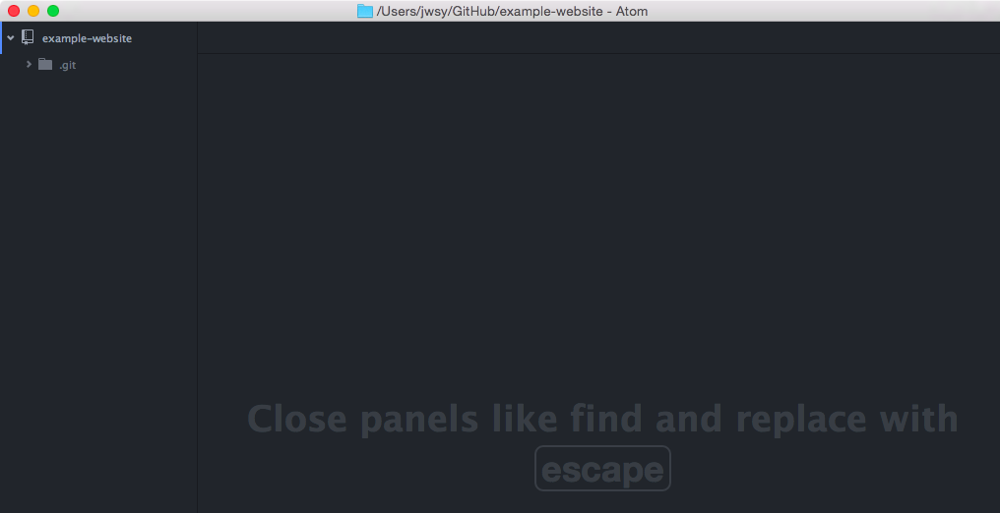

1. In Atom, create an index.html file by right-clicking the repo name and selecting _New File_, and name the file _index.html_.

  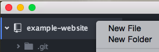

  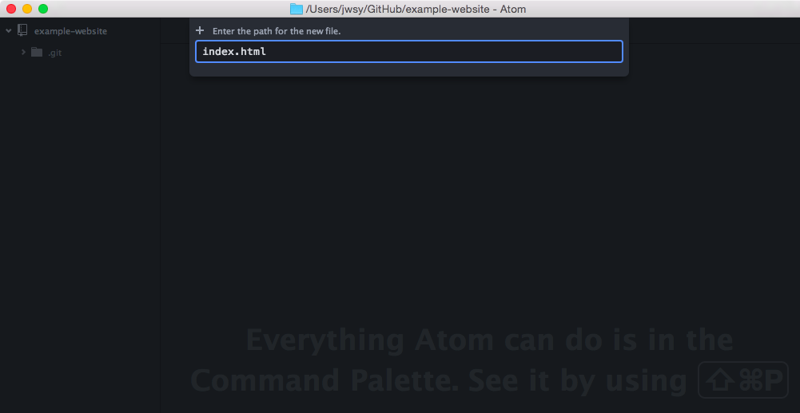

1. Add in your basic HTML to _index.html_. This should feel just like the Codecademy coding "IDE" (Interactive Development Environment) except now you're out of a browser and creating an actual file on your computer. You can copy the one I used in the example from [here](https://github.com/jwsy/example-website/blob/99509e2b6c1adc8bb959b2cf239a2a3047a7a493/index.html):

  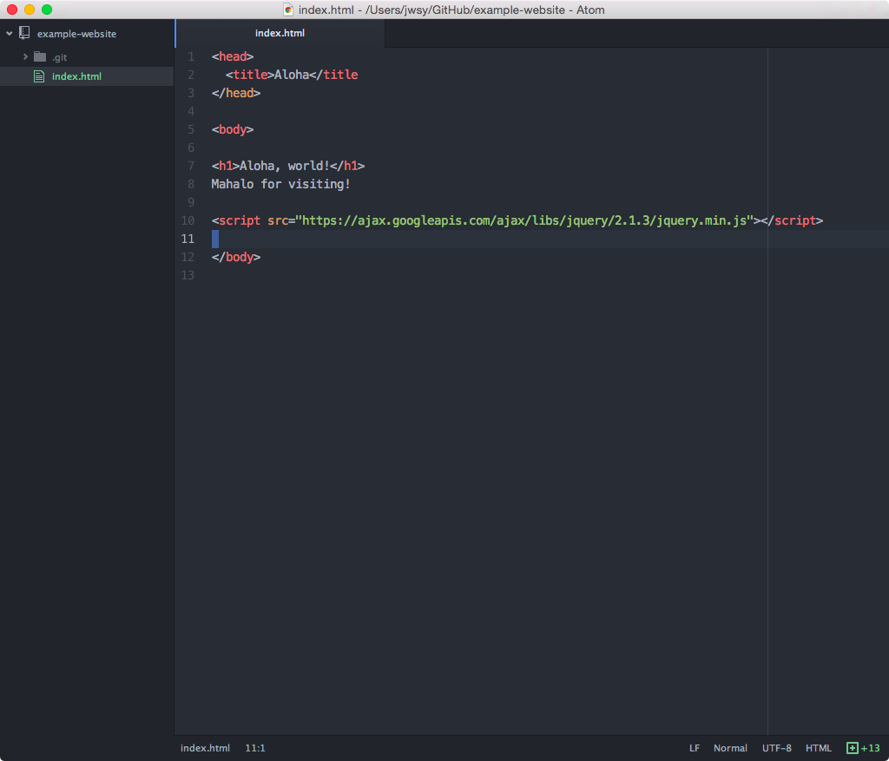

  Keen eyed readers will notice that I missed the closing '>' in my title tag. It doesn't change anything in the tutorial, but good eye :+1:

1. You can view this actual file on your computer by right-clicking the _index.html_ file and selecting "Show in Finder"

  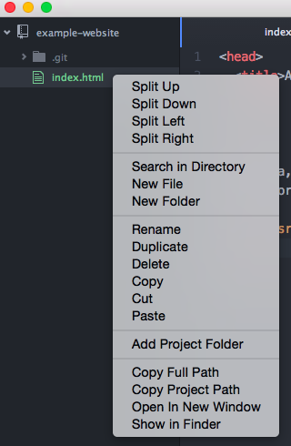

  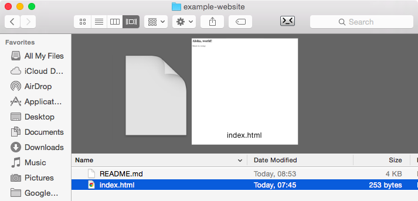

  Double-clicking the _index.html_ file should open it up in a web browser where you can see your code rendered like it would be if you were to host it on the internet.

  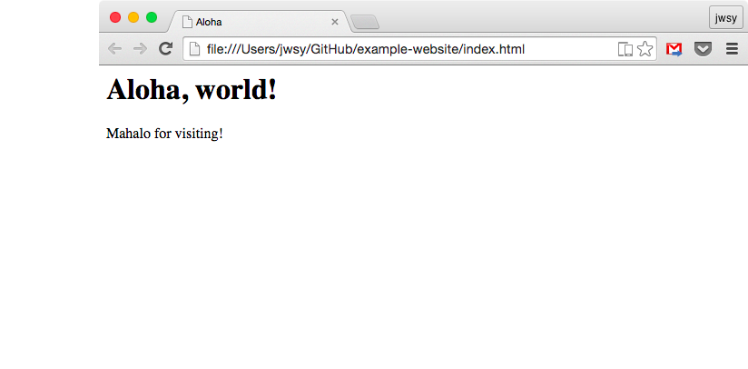

  Try making more changes to _index.html_ and refreshing your browser.

### Host your page in GitHub Pages

1. Now that you've got a working page in your repo, make a commit and push it to GitHub where it will be hosted. To do this, go back to GitHub Desktop, enter a commit message like "Create index.html" and click the _Commit to gh-pages_ button -- it's important to make sure you're committing to _gh-pages_. Then click the _Sync_ button in the upper right to copy your repo to GitHub Pages.

  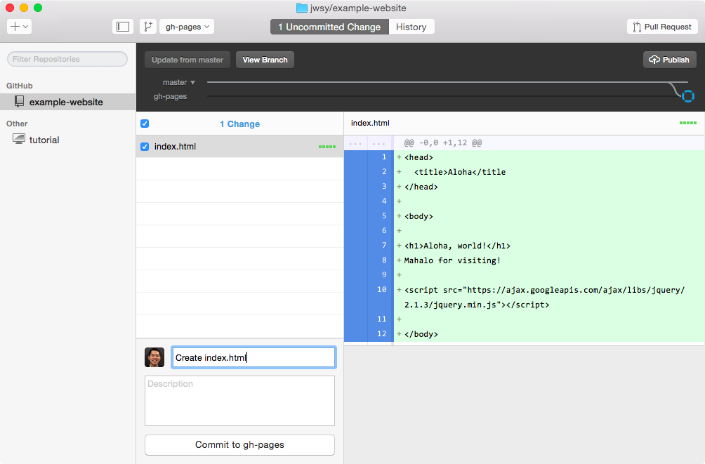

1. Visit your project site at https://github.com/YOUR_USERNAME/example-website. If you change the branch from _master_ to _gh-pages_, you should see the files you've committed.

  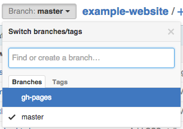

  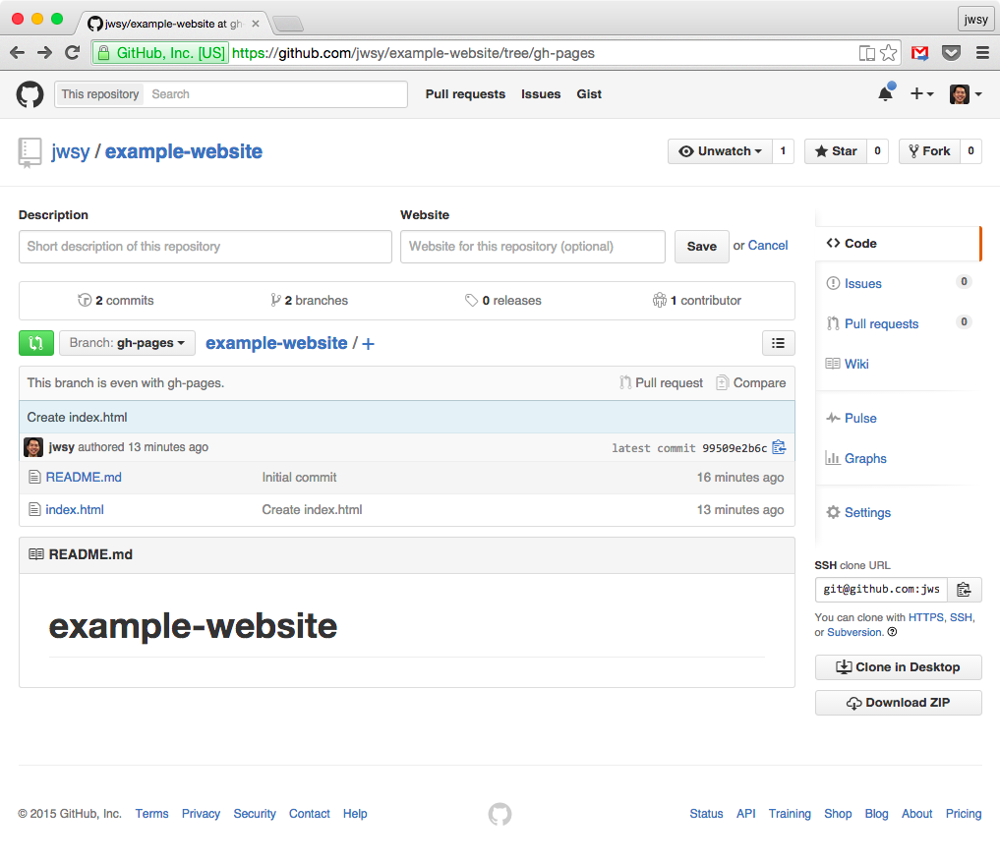

1. Finally, view your page at http://YOUR_USERNAME.github.io/example-website (mine is [http://jwsy.github.io/example-website](http://jwsy.github.io/example-website)) -- congratulations! :smile:

  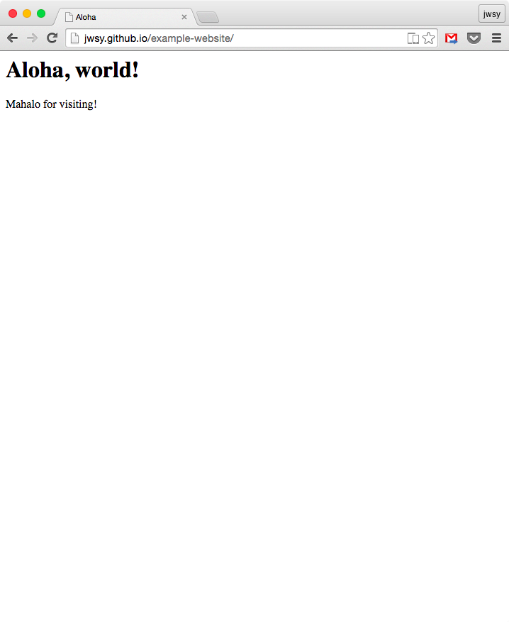

### Update your website

1. Go back to Atom and add a _css_ folder for CSS and a _style.css_ stylesheet for your page.

  To add the folder, right-click below the files in the left pane.

  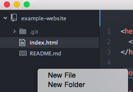

  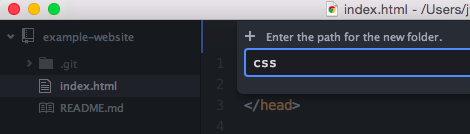

1. Right-click the new _css_ folder and create a _style.css_ file.

  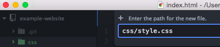

1. Edit _style.css_ to add some color to the page, just like how you did in Codecademy. See my papayawhip example [here](https://github.com/jwsy/example-website/blob/master/css/style.css).

  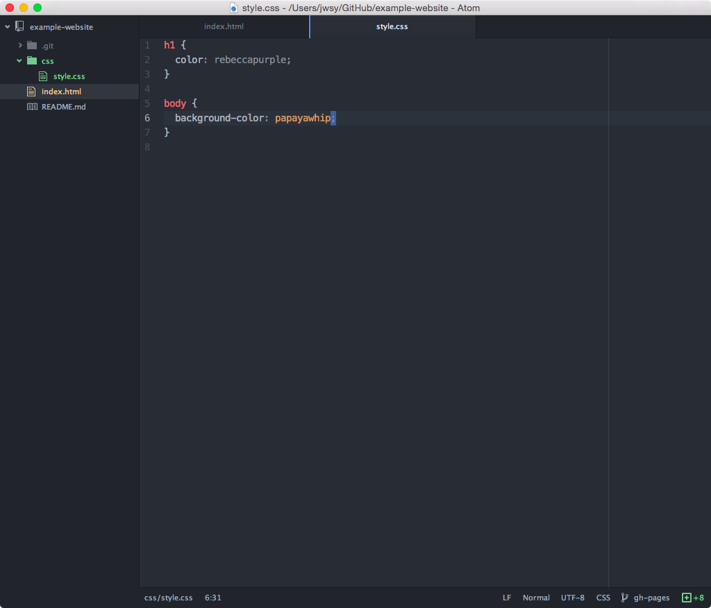

1. Edit _index.html_ and add a link to the stylesheet you just added. In this example, I add:
  
  ```html
    <link rel="stylesheet" type="text/css" href="css/style.css">
  ```

  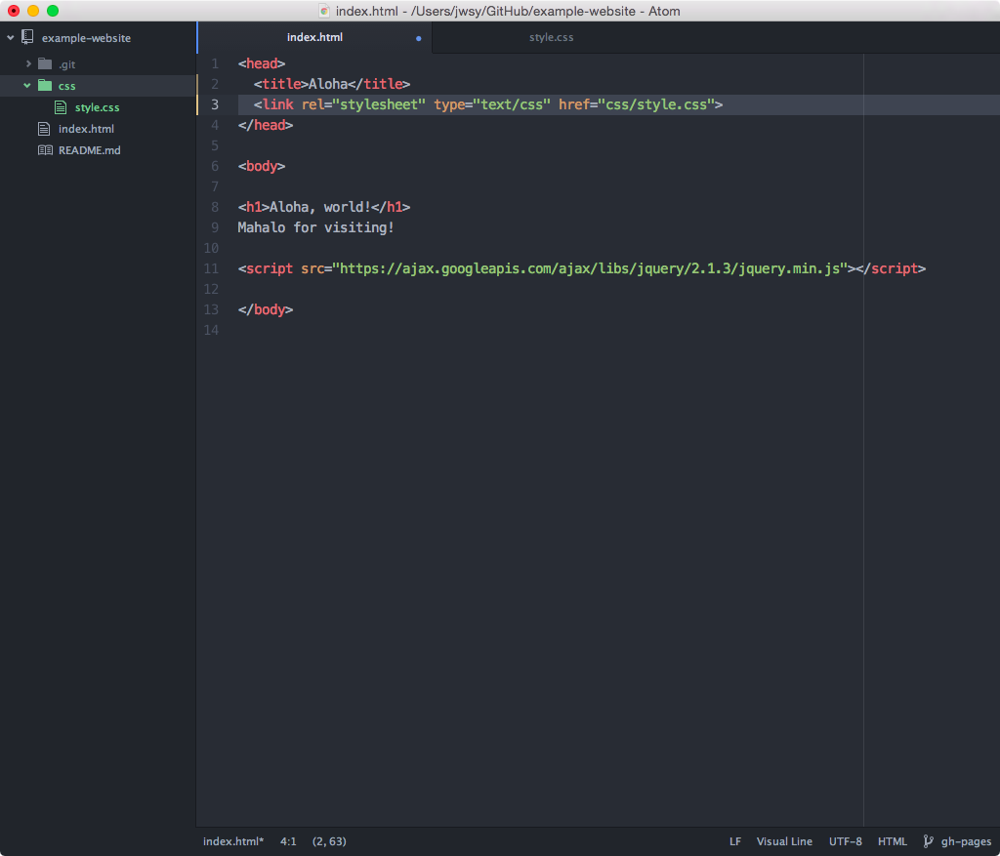

1. View your local website the same way you did before by selecting _Show in Finder_ and opening the file in your browser. Mine looked like this, and note the URL that starts with "file:///"

  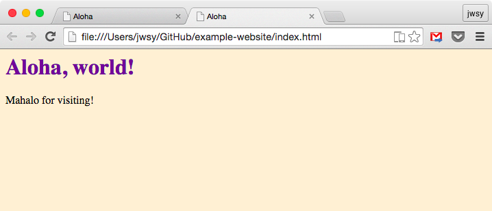

1. Go back to GitHub Desktop and take a look at how it's tracked    your changes. You should see your stylesheet and HTML as the two changes.

  Like before, add a commit message, click the _Commit to gh-pages_ button, and click the _Sync_ button.

  If you want to make more changes, follow the same workflow of editing locally, committing, and syncing.

  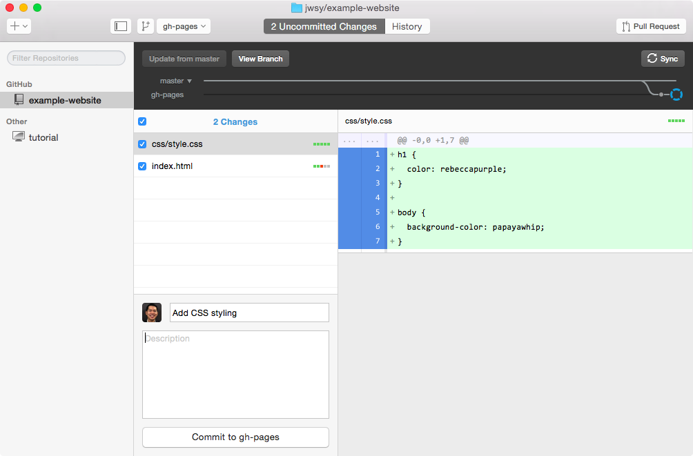

1. Go to your project site on GitHub, visit the gh-pages branch, and make sure that your new CSS folder and updated index page are there.

  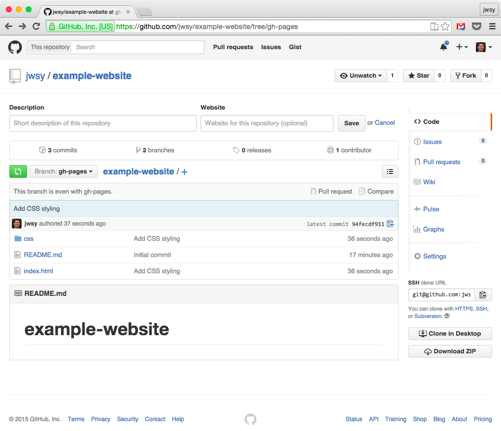

  And finally, visit your updated page with your updated code.

  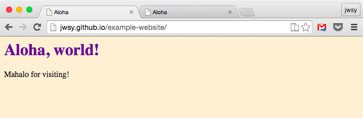

Congratulations: you've made your own simple website and hosted it in GitHub Pages using the skills you've learned at Codecademy! :smile:
