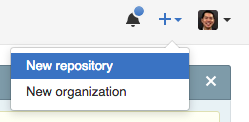

# example-website
This is a tutorial on what to do once you've finished building a website in the fantastic <a href="https://www.codecademy.com/en/skills/make-a-website" target="_blank">Codecademy tutorials</a> and want to make your own web pages and limited apps. This tutorial specifically describes how to set up a website hosted by GitHub using the Github Desktop GUI in OSX.

### Prerequisites
* GitHub Account at <a href="https://github.com" target="_blank">https://github.com</a>
* Install the <a href="https://atom.io" target="_blank">Atom text editor</a>
* Install <a href="https://atom.io" target="_blank">GitHub Desktop</a>

### Overview
We'll start by setting up a your "development environment" and then creating and contributing to a repository in GitHub. Ultimately, we'll finish with a page hosted on the internet that you can access from anywhere.

## Initial Setup

1. Install the <a href="https://atom.io" target="_blank">Atom text editor</a>

1. Get an account at <a href="https://github.com" target="_blank">https://github.com</a>. Once you've created your account, create a new repository by clicking the '+' sign next to your profile pic in the upper right.

  

1.  Create a repository, in this example I create one named _example-website_. Make it _Public_ and use the defaults.

  

1. Once the repository is created, install and configure GitHub Desktop. Configuration requires you to sign in with your Github account credentials that you created earlier.

  

1. In GitHub Desktop, click the '+' in the upper left and clone the repo you just created.

  

Congratulations, you're ready to start building your webpage!

### Writing some code

1. Once you've cloned the repo, click the branch button and create a new branch named _gh-pages_ -- this name is important and more detail about this can be found in the [GitHub Pages documentation](https://pages.github.com/).

  

1. In GitHub Desktop, edit your repo in your text editor Atom by right-clicking the repo and selecting Open in Atom. Be sure that the repo you're working on is gh-pages as shown in the upper-right of the below image.

  

1. In Atom, create an index.html file by right-clicking the repo name and selecting _New File_, and name the file _index.html_. This is just like what you did in Codecademy!

  

  
